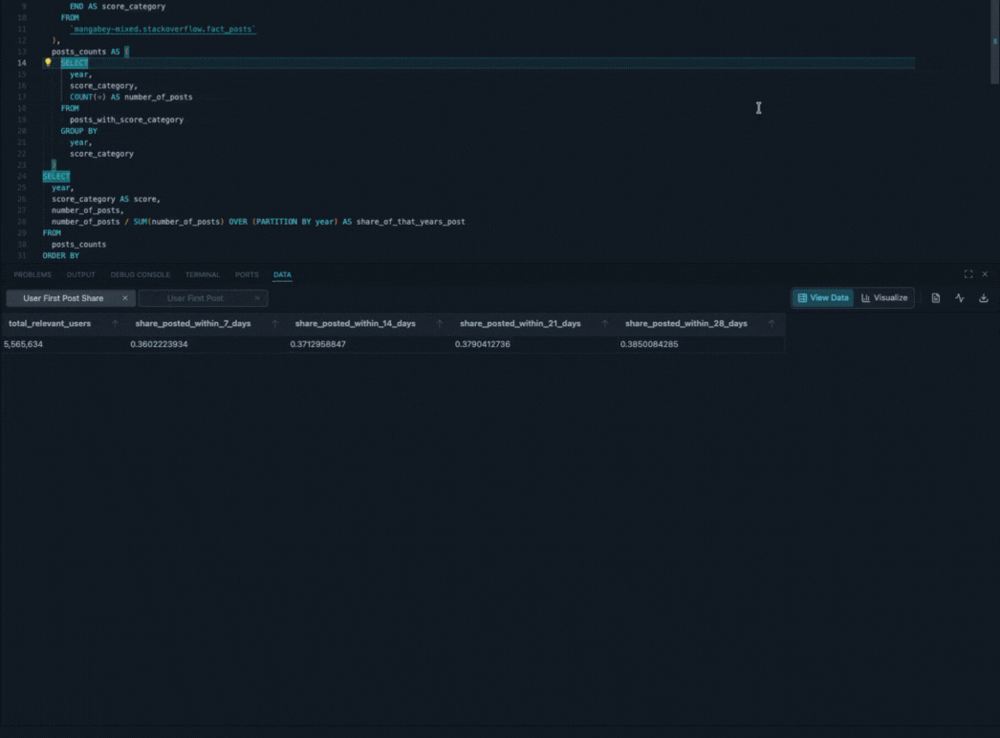
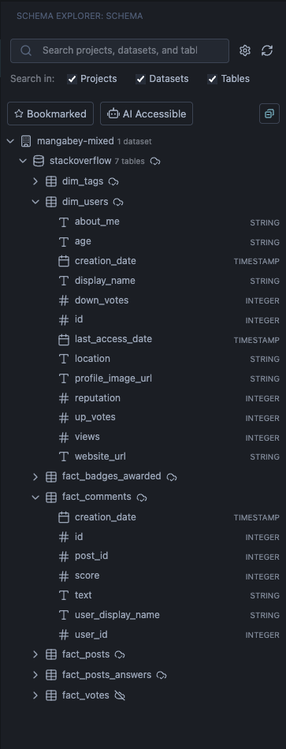
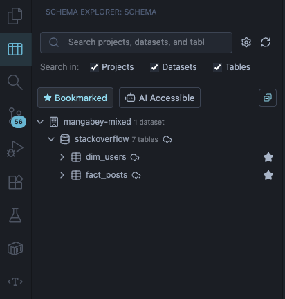
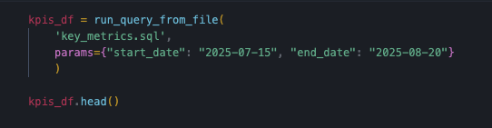
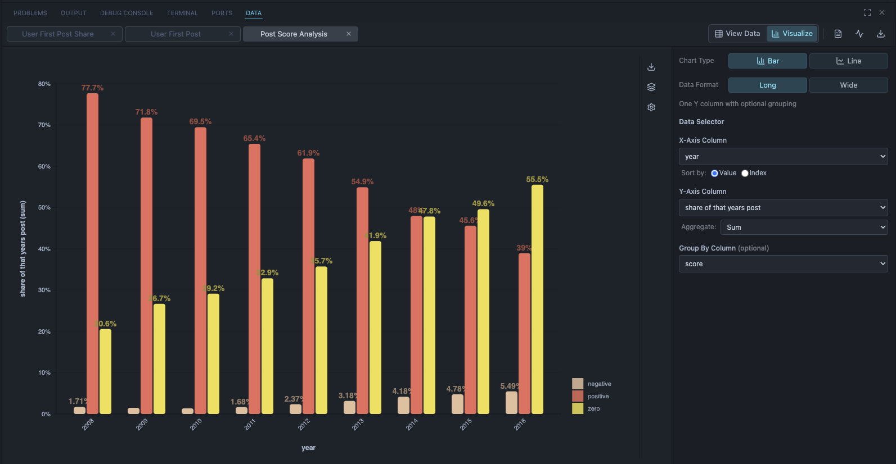
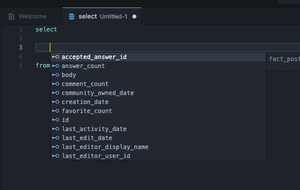
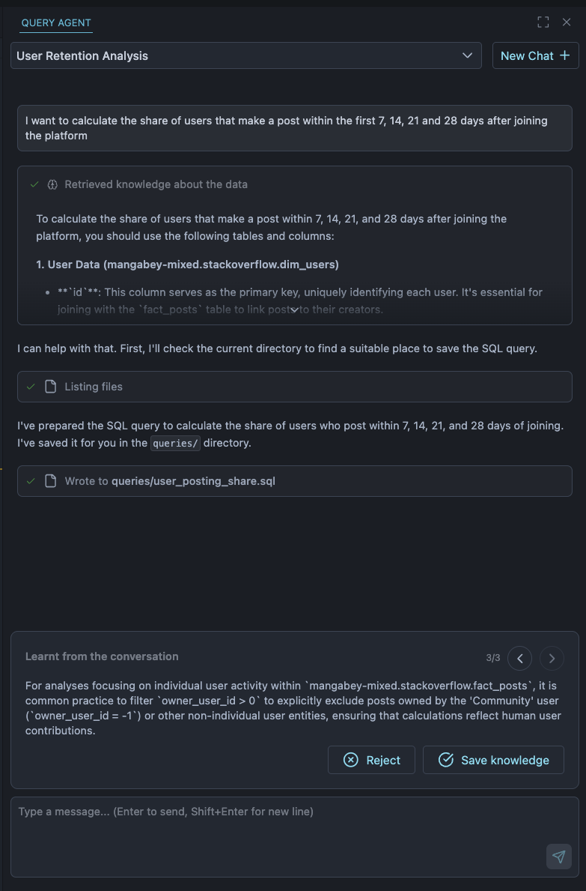
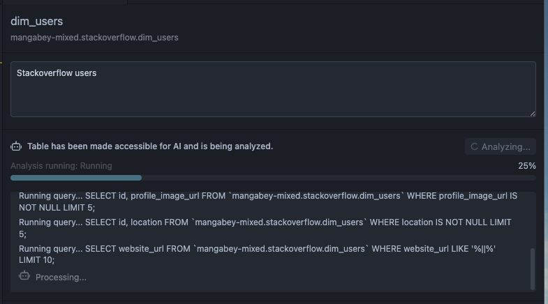
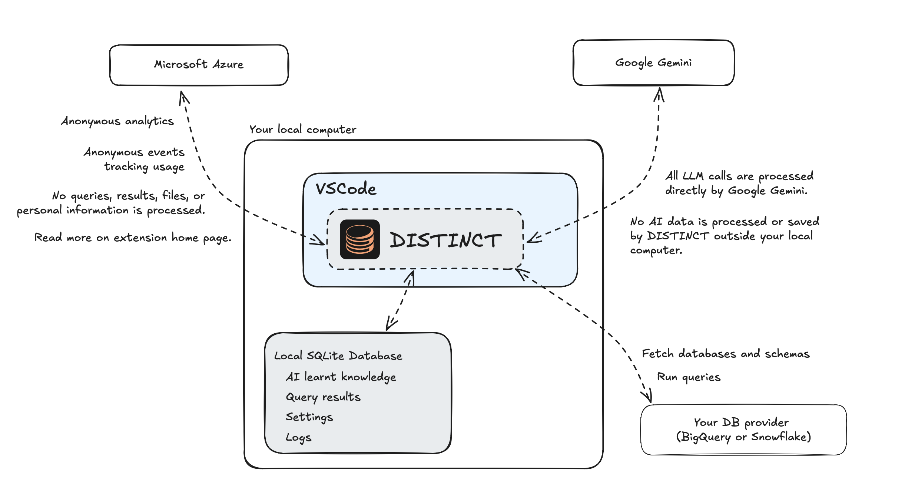

# Distinct

Explore and query your data warehouse with AI-powered assistance.
Works with BigQuery and Snowflake.

Distinct transforms your VSCode into a powerful data workspace. Write SQL with intelligent completions, visualize results instantly, and let AI help you craft complex queries. Apart from optional AI requests to Gemini, everything runs locally with your data staying on your machine. Whether you're exploring new datasets, building analysis pipelines, or collaborating with your team, Distinct streamlines your entire workflow from query to insight.

**Key Features:**

- Explore database objects with intelligent syncing
- Ad-hoc query windows for rapid development
- Powerful query runner with parameterized query support
- Clean, interactive data views
- Quick and beautiful chart generation
- AI Query Chatbot trained on your schema

## Explore Your Database Objects

Choose which objects to sync and get a comprehensive overview of tables and their schemas.

Bookmark the most important tables for quick access.

## Ad-hoc Query Window

Create an ad-hoc query window with `CMD+Option+N` (Mac) or `Ctrl+Alt+N` (Windows/Linux).

Write and test queries quickly, then save them to your VSCode project when you're satisfied with the results.

## Run Your Queries

Execute any SQL file or ad-hoc query with `CMD+Enter` (Mac) or `Ctrl+Enter` (Windows/Linux).

## Parameterized Queries

- Define parameters in queries using either `:` or `@` syntax
- Set parameter values in the parameters panel
- Use the Python package to run parameterized queries in your scripts or Jupyter notebooks

    

## Data View

View your query results in a clean, interactive interface.

- Drag and select data to copy to any application that supports tables
- Export to CSV, XLSX, and Google Sheets
- Clean visualization of arrays and structs

    

## Quick and Beautiful Charts

Create charts from your query results with just a few clicks.

## Coming Soon: Ad-hoc Dashboards

- Create parameterized queries and define connected charts
- Export to an ad-hoc dashboard with exposed parameters
- Set up cloud connections to share dashboards with your team

## Code Completions and IntelliSense

Get intelligent SQL code highlighting, suggestions, and completions as you write.

## AI Query Chatbot

An intelligent chatbot that helps you write queries specific to your data warehouse.

Choose which tables should be accessible to the AI. The AI analyzes tables beforehand to understand all the logic and details necessary to help you write better queries.

The AI agent continuously learns while you use the tool:

- Learns from your queries
- Learns from your conversations
- Learns from the data results

### Updates Coming Soon!

The AI chatbot is under active development with major updates coming soon. The current version is a preview of the setup and workflow.

_Note: You can disable AI features if you prefer not to use them._

## Interaction with Other SQL Extensions

If you experience issues with code completions or query execution, another SQL-related extension may be conflicting with Distinct. Try disabling other SQL extensions to resolve the issue.

## Coming Soon: Share AI Knowledge Across Your Team

When your AI agent learns about your data, you'll be able to share that knowledge with your entire team.

## Data Processing

Distinct is designed with privacy in mind. All your data, query results, and AI learnt knowledge are stored locally in a SQLite database on your computer. When using AI features, requests are sent directly to Google Gemini without any intermediate processing by Distinct. Only anonymous usage analytics are sent to Microsoft Azure to help improve the extension - no queries, results, or personal information ever leaves your machine except when you explicitly connect to your data warehouse. Read more under Telemetry.

## Telemetry

This extension collects anonymous usage data to help improve the product. All telemetry respects VS Code's telemetry settings and follows industry best practices. We never collect personally identifiable information (PII), SQL query content, or file paths.

For detailed information about data collection, see [TELEMETRY.md](TELEMETRY.md).
